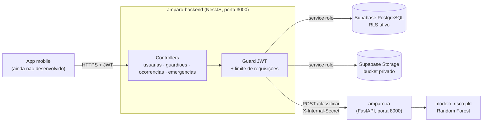

# Amparo


O **Amparo** é um sistema de apoio a mulheres em situação de violência. Ele permite registrar ocorrências e guardar evidências com segurança, manter uma rede de guardiãs de confiança, acionar um botão de emergência com localização e receber uma **classificação de risco** (baixo, médio ou alto) feita por um modelo de inteligência artificial.

O problema que ele resolve: provas de violência costumam se perder ou ficar acessíveis ao agressor, e o pedido de ajuda precisa ser rápido. O Amparo guarda as provas fora do alcance do agressor, avisa a rede de apoio e ajuda a identificar quando a situação está se agravando.

> **Estado atual:** o backend e o serviço de IA estão funcionando. O aplicativo mobile (`amparo-mobile/`) ainda não foi desenvolvido, e o envio de mensagens às guardiãs é **simulado** (registrado no log do servidor).

## Sumário

- [Funcionalidades](#funcionalidades)
- [Tecnologias](#tecnologias)
- [Arquitetura](#arquitetura)
- [Estrutura de pastas](#estrutura-de-pastas)
- [Pré-requisitos](#pré-requisitos)
- [Instalação e configuração](#instalação-e-configuração)
- [Como rodar](#como-rodar)
- [Testes](#testes)
- [Treinamento do modelo de IA](#treinamento-do-modelo-de-ia)
- [Como usar a API](#como-usar-a-api)
- [Solução de problemas](#solução-de-problemas)
- [Como contribuir](#como-contribuir)
- [Licença e contato](#licença-e-contato)

## Funcionalidades

**Conta e acesso**
- Cadastro com validação de CPF (dígitos verificadores, com ou sem máscara) e senha forte (letras e números, sem sequências nem senhas comuns).
- Login com senha e **login disfarçado**: uma segunda senha, pensada para abrir o app a partir de uma tela de calculadora.
- Logout com revogação do token e exclusão definitiva da conta (confirmada com a senha).

**Rede de apoio**
- De 1 a 5 guardiãs por usuária, sem repetir a mesma pessoa (telefone). A última guardiã não pode ser removida enquanto a conta existir.

**Ocorrências e evidências**
- Registro de ocorrências com tipos de violência (física, sexual, ameaça, psicológica, moral e patrimonial), data em que aconteceu e localização opcionais.
- Visualização e edição da ocorrência. A edição fica registrada e recalcula o risco.
- Upload de fotos, vídeos, áudios e PDFs (boletim, laudo) para um armazenamento privado, com verificação do conteúdo real do arquivo e hash SHA-256 para provar integridade.
- Download da própria evidência por um link temporário de 5 minutos.
- Listagem paginada.

**Botão de emergência**
- Acionamento com notificação (simulada) das guardiãs, rastreamento de localização e encerramento.
- Apenas uma emergência ativa por usuária, mesmo com cliques repetidos.
- Acionamentos encerrados em até 30 segundos são tratados como engano e não aumentam o risco.

**Classificação de risco**
- A cada ocorrência, o histórico da usuária é resumido e enviado ao serviço de IA.
- Quando o risco sobe para **alto**, é gerado um alerta para as guardiãs, com horário e link da última localização.

## Tecnologias

| Parte | Tecnologias |
|---|---|
| Backend | TypeScript, NestJS 12, class-validator, @nestjs/jwt, @nestjs/throttler, Helmet, bcrypt |
| Banco e arquivos | Supabase (PostgreSQL com RLS e Storage), via `@supabase/supabase-js` |
| IA | Python, FastAPI, Uvicorn, scikit-learn (Random Forest), pandas, NumPy, Pydantic |
| Testes e qualidade | Jest, Supertest, ts-jest, Babel, oxlint, Prettier |
| Relatórios da IA | matplotlib, reportlab, python-docx (usados só nos scripts do pipeline) |

## Arquitetura



Como as partes conversam:

1. O app chama a API do backend com um token JWT.
2. O backend valida o token e o limite de requisições, aplica as regras de negócio e grava no Supabase. Todo o acesso ao banco passa pelo backend: o RLS bloqueia acesso direto com a chave pública.
3. Ao registrar uma ocorrência, o backend resume o histórico da usuária (contagens e indicadores, sem nome, CPF ou texto) e chama a IA com um segredo compartilhado.
4. A IA devolve o nível de risco. O backend grava o resultado e, se o risco passou a ser alto, registra um alerta para as guardiãs.

## Estrutura de pastas

```text
projeto-amparo/
├── amparo-backend/            API NestJS
│   ├── src/
│   │   ├── auth/              guard JWT, revogação de tokens, decoradores
│   │   ├── common/            tratamento de erros, verificação de arquivos, limite por usuária
│   │   ├── usuarias/          cadastro, login, logout, exclusão de conta
│   │   ├── guardioes/         rede de apoio
│   │   ├── ocorrencias/       ocorrências, evidências e chamada da IA
│   │   └── emergencias/       botão de emergência e rastreamento
│   ├── supabase/              scripts SQL (RLS, funções, índices, tabelas)
│   └── test/                  testes e2e e configuração do Jest
├── amparo-ia/                 serviço de IA
│   ├── main.py                API FastAPI (POST /classificar)
│   ├── modelo_risco.pkl       modelo em produção (v3)
│   ├── colunas_modelo.pkl     ordem das variáveis do modelo
│   ├── modelos_anteriores/    versões anteriores (v1, v2) para voltar se precisar
│   └── pipeline_v2/           geração de dados, treino, testes e relatórios
├── Relatorios/                relatórios técnicos, gráficos e PDFs
├── amparo-mobile/             reservado para o app (vazio)
├── amparo-obsidian/           notas pessoais (não faz parte do sistema)
└── _backup_organizacao/       arquivos antigos guardados na reorganização
```

## Pré-requisitos

| Ferramenta | Versão |
|---|---|
| Node.js e npm | 24 (versão usada no desenvolvimento e nos testes) |
| Python | 3.10 ou superior (o código usa a sintaxe `str \| None`). Testado com 3.14 |
| Supabase | um projeto com PostgreSQL e Storage |
| Git | qualquer versão recente |

## Instalação e configuração

### 1. Clonar o repositório

```bash
git clone https://github.com/ccriascco/projeto-amparo.git
cd projeto-amparo
```

### 2. Preparar o banco no Supabase

No SQL Editor do Supabase, com as tabelas `usuarias`, `guardioes`, `ocorrencias`, `evidencias`, `emergencias` e `rastreamento_gps` já criadas, rode os scripts de `amparo-backend/supabase/` nesta ordem:

1. `habilitar_rls.sql`
2. `cadastrar_usuaria_transacional.sql`
3. `alertas_risco.sql`
4. `emergencia_unica_ativa.sql` (antes, rode a consulta de verificação que está no próprio arquivo)
5. `logout_e_exclusao_conta.sql`
6. `janela_30_dias_e_lgpd.sql` (inclui uma consulta de verificação; rode antes de subir o backend)

Crie também o bucket de Storage **`evidencias_amparo`**, como **privado** e sem políticas para `anon` ou `public`.

### 3. Backend

```bash
cd amparo-backend
npm install
```

Crie `amparo-backend/.env`. Este arquivo não vai para o git.

```dotenv
SUPABASE_URL=https://seu-projeto.supabase.co
SUPABASE_SERVICE_ROLE_KEY=coloque-aqui-a-service-role-key
JWT_SECRET=gere-um-valor-aleatorio-longo
JWT_EXPIRES_IN=2h
IA_SHARED_SECRET=gere-outro-valor-aleatorio-longo
IA_SERVICE_URL=http://127.0.0.1:8000
PORT=3000
```

| Variável | Obrigatória | Descrição |
|---|---|---|
| `SUPABASE_URL` | sim | URL do projeto Supabase |
| `SUPABASE_SERVICE_ROLE_KEY` | sim | Chave do backend. **Nunca** coloque em um app ou site: ela ignora o RLS |
| `JWT_SECRET` | sim | Segredo para assinar os tokens. Use um valor diferente em cada ambiente |
| `JWT_EXPIRES_IN` | não | Validade do token (padrão `2h`) |
| `IA_SHARED_SECRET` | sim | Segredo compartilhado com o serviço de IA |
| `IA_SERVICE_URL` | não | Endereço da IA (padrão `http://127.0.0.1:8000`) |
| `PORT` | não | Porta da API (padrão `3000`) |

Para gerar valores aleatórios:

```bash
node -e "console.log(require('crypto').randomBytes(48).toString('base64'))"
```

### 4. Serviço de IA

```bash
cd amparo-ia
python -m venv venv
venv\Scripts\activate
pip install -r requirements.txt
```

No Linux ou macOS, ative com `source venv/bin/activate`.

A IA lê `IA_SHARED_SECRET` do ambiente, de `amparo-ia/.env` ou, se não existir, de `amparo-backend/.env`. **Sem esse segredo, ela não sobe.**

## Como rodar

São dois processos, em dois terminais.

**Desenvolvimento**

```bash
cd amparo-backend
npm run start:dev
```

```bash
cd amparo-ia
venv\Scripts\activate
python -m uvicorn main:app --port 8000 --reload
```

**Produção**

```bash
cd amparo-backend
npm run build
npm run start:prod
```

```bash
cd amparo-ia
python -m uvicorn main:app --host 127.0.0.1 --port 8000
```

Mantenha a IA acessível só pelo backend (em `127.0.0.1` ou numa rede privada).

**Verificar se está no ar**

```bash
curl -i http://localhost:3000/
```

A resposta esperada é `401`: a rota existe e exige login.

## Testes

```bash
cd amparo-backend
npm test            # unitários
npm run test:e2e    # rotas da API
npm run test:cov    # unitários com relatório de cobertura (pasta coverage/)
npm run lint        # análise estática (oxlint)
```

| Tipo | O que cobre | Usa o banco? |
|---|---|---|
| Unitários (110 testes) | Regras de negócio dos services, CPF, senha forte, janela de 30 dias do risco, guard JWT e revogação, tratamento de erros, verificação de arquivos, concorrência do botão de emergência | Não: o Supabase é simulado |
| E2E básico (6 testes) | Autenticação obrigatória, token forjado, validação de entrada e campos não permitidos | Não grava dados |
| E2E de fluxo completo (125 testes) | A aplicação inteira, do cadastro à exclusão de conta, sobre um banco em memória com as regras do banco. Rede bloqueada: nunca acessa o Supabase. Com `IA_REAL=1`, a seção de risco usa a IA real | Não: banco em memória |

O serviço de IA não tem testes automatizados (`amparo-ia/test_local.py` é só um script manual que carrega o modelo e faz uma previsão). A avaliação do modelo é feita pelo pipeline descrito abaixo.

## Treinamento do modelo de IA

O modelo em produção é um **Random Forest** (100 árvores) com 11 variáveis: idade, total de ocorrências, dias desde a última, aumento de frequência, indicadores para cada tipo de violência e quantidade de acionamentos válidos do botão.

> **Atenção:** o modelo foi treinado com **dados sintéticos** rotulados pelas regras de negócio do projeto. As métricas medem a capacidade de reproduzir essas regras, **não** o desempenho com casos reais. Antes de usar em produção real, valide com casos rotulados por profissionais.

### Regras de risco usadas como gabarito

Definidas em `amparo-ia/pipeline_v2/regras.py`:

| Situação | Risco |
|---|---|
| Violência física ou sexual | Alto |
| Ameaça | Médio |
| Psicológica, moral ou patrimonial | Baixo |
| Janela | só contam ocorrências e acionamentos válidos dos **últimos 30 dias**, pela data em que a violência aconteceu (ou do registro) |
| 2 ou mais ocorrências em 30 dias | sobe um nível |
| Acionamento válido do botão | no mínimo Médio; Alto se houver violência física/sexual ou ocorrência nos últimos 15 dias |
| Acionamento encerrado em até 30 s | ignorado (engano) |
| Nada nos últimos 30 dias, mas com histórico antigo | Baixo (aplicada pela API, fora do modelo) |
| Nunca registrou ocorrência nem acionamento válido | Médio, por segurança (aplicada pela API, fora do modelo) |

### Passo a passo

Execute a partir de `amparo-ia/pipeline_v2/`, com o ambiente da IA ativado. Os gráficos e documentos usam bibliotecas que não estão no `requirements.txt` do serviço:

```bash
pip install matplotlib reportlab python-docx
```

```bash
cd amparo-ia/pipeline_v2
python gerar_dados.py   # gera dados/treino.csv, validacao.csv, teste.csv e os casos de borda
python treinar.py       # busca de hiperparâmetros e salva modelo_candidato.pkl
python testar.py        # avalia o candidato contra as versões anteriores
python graficos_v3.py   # gera os gráficos em Relatorios/ia_v3/
```

Detalhes importantes:

- `gerar_dados.py` gera 9.000 casos equilibrados entre os três níveis e divide em 70/15/15, sem repetição entre os conjuntos. Treino e validação recebem 10% de rótulos trocados (`RUIDO_ROTULO`), para simular erros humanos. O teste fica limpo. A semente fica em `SEMENTE`.
- `treinar.py` **não** substitui o modelo em produção. Ele salva `modelo_candidato.pkl` e `colunas_candidato.pkl` na pasta do pipeline.
- `testar.py` calcula acurácia, precisão, recall, F1, matriz de confusão e erros perigosos (risco alto classificado como baixo), e testa os 20 casos de borda.

Scripts de análise:

| Script | O que faz |
|---|---|
| `comparar_modelos.py` | Compara Random Forest e Árvore de Decisão nos conjuntos de `treinos/` |
| `robustez.py` | Mede os dois modelos com 0% a 30% de rótulos errados no treino |
| `simular_usuarias.py` | Envia usuárias fictícias para a IA em execução e compara com a regra |
| `gerar_pdf_metricas.py`, `gerar_pdf_comparacao.py` | Geram os PDFs em `Relatorios/` |

### Colocar um novo modelo em produção

1. Guarde a versão atual:

   ```bash
   mkdir amparo-ia/modelos_anteriores/vN
   cp amparo-ia/modelo_risco.pkl amparo-ia/colunas_modelo.pkl amparo-ia/modelos_anteriores/vN/
   ```

2. Copie o candidato:

   ```bash
   cp amparo-ia/pipeline_v2/modelo_candidato.pkl amparo-ia/modelo_risco.pkl
   cp amparo-ia/pipeline_v2/colunas_candidato.pkl amparo-ia/colunas_modelo.pkl
   ```

3. Reinicie o serviço de IA. O modelo é carregado na subida.

Para voltar, copie os arquivos de `modelos_anteriores/` de volta para `amparo-ia/` e reinicie.

> Não use `amparo-ia/treinar_final.py`, `gerador_dados.py` e `avaliador_modelos.py` na raiz da IA. São do pipeline antigo (v1): `treinar_final.py` **sobrescreve o modelo em produção** por um de 8 variáveis, que ignora os tipos psicológica, moral e patrimonial.

### Onde ficam os resultados

| Local | Conteúdo |
|---|---|
| `amparo-ia/pipeline_v2/resultados/` | `treino.json`, `teste.json`, `borda_resultados.csv`, `simulacao.csv` |
| `amparo-ia/pipeline_v2/treinos/` | dados e resultados de cada rodada de treino da v3, e a comparação de algoritmos |
| `Relatorios/relatorio_ia_v2.md` | relatório completo do treinamento |
| `Relatorios/metricas_modelos.pdf` | métricas por nível e matrizes de confusão |
| `Relatorios/comparacao_random_forest_vs_arvore.pdf` | comparação de algoritmos e robustez a rótulos errados |
| `Relatorios/ia_v2/`, `ia_v3/`, `ia_comparacao/` | gráficos |

## Como usar a API

Os exemplos usam dados fictícios. Todas as rotas, exceto cadastro e login, exigem `Authorization: Bearer <token>`.

### Cadastrar uma usuária

```bash
curl -X POST http://localhost:3000/usuarias \
  -H "Content-Type: application/json" \
  -d '{
    "cpf": "529.982.247-25",
    "email": "maria@exemplo.com",
    "telefone": "11988887777",
    "nome_completo": "Maria Exemplo",
    "data_nascimento": "1990-03-15",
    "senha": "SenhaForte123",
    "senha_app": "calc98765",
    "guardioes": [{ "nome_completo": "Joana Exemplo", "telefone": "11999990001", "parentesco_relacao": "irmã" }]
  }'
```

```json
{ "mensagem": "Usuária e guardiã(s) cadastradas com sucesso!", "usuaria_id": "3f2c...e91a" }
```

### Fazer login

```bash
curl -X POST http://localhost:3000/usuarias/login \
  -H "Content-Type: application/json" \
  -d '{ "email": "maria@exemplo.com", "senha": "SenhaForte123" }'
```

```json
{
  "mensagem": "Login realizado com sucesso! 🛡️",
  "access_token": "eyJhbGciOi...",
  "usuaria": { "id": "3f2c...e91a", "nome_completo": "Maria Exemplo", "email": "maria@exemplo.com", "modo_disfarcado": false }
}
```

### Registrar uma ocorrência

```bash
curl -X POST http://localhost:3000/ocorrencias \
  -H "Authorization: Bearer $TOKEN" \
  -H "Content-Type: application/json" \
  -d '{ "tipos_violencia": ["Física", "Ameaça"], "mensagem": "Discussão em casa", "latitude": -23.5505, "longitude": -46.6333 }'
```

Tipos aceitos: `Física`, `Psicológica`, `Sexual`, `Patrimonial`, `Moral`, `Ameaça`. O campo opcional `data_ocorrencia` (`AAAA-MM-DD`, não pode ser futura) informa quando a violência aconteceu.

```json
{ "mensagem": "Ocorrência registrada com sucesso!", "ocorrencia": { "id": "a940...", "tipos_violencia": ["Física", "Ameaça"], "criado_em": "2026-10-05T17:10:29Z" } }
```

A classificação de risco roda em segundo plano depois da resposta.

### Anexar uma evidência

```bash
curl -X POST http://localhost:3000/ocorrencias/<id>/evidencias \
  -H "Authorization: Bearer $TOKEN" \
  -F "arquivo=@foto.jpg;type=image/jpeg"
```

Limites: foto até 5 MB, áudio e PDF até 10 MB, vídeo até 20 MB.

Para baixar a evidência, peça um link temporário (válido por 5 minutos):

```bash
curl http://localhost:3000/ocorrencias/<id>/evidencias/<evidenciaId> -H "Authorization: Bearer $TOKEN"
```

```json
{ "url": "https://...supabase.co/storage/v1/object/sign/...", "expira_em_segundos": 300, "tipo": "IMAGE", "hash_integridade": "9f86d0..." }
```

### Acionar o botão de emergência

```bash
curl -X POST http://localhost:3000/emergencias/acionar \
  -H "Authorization: Bearer $TOKEN" \
  -H "Content-Type: application/json" \
  -d '{ "latitude": -23.5505, "longitude": -46.6333 }'
```

```json
{ "mensagem": "Emergência acionada!", "emergencia_id": "21c3...", "guardioes_notificados": 1, "status_notificacao": "SUCESSO" }
```

Se já existir uma emergência ativa, a resposta é `409`. Para encerrar: `POST /emergencias/<id>/encerrar`.

### Sair e excluir a conta

```bash
curl -X POST http://localhost:3000/usuarias/logout -H "Authorization: Bearer $TOKEN"
```

```bash
curl -X DELETE http://localhost:3000/usuarias/me \
  -H "Authorization: Bearer $TOKEN" \
  -H "Content-Type: application/json" \
  -d '{ "senha": "SenhaForte123" }'
```

### Chamar a IA diretamente (uso interno)

Normalmente só o backend chama a IA.

```bash
curl -X POST http://127.0.0.1:8000/classificar \
  -H "Content-Type: application/json" \
  -H "X-Internal-Secret: $IA_SHARED_SECRET" \
  -d '{ "idade": 30, "qtd_ocorrencias_totais": 1, "dias_desde_ultima_ocorrencia": 0, "frequencia_aumentou": 0,
        "teve_viol_fisica": 1, "teve_viol_sexual": 0, "teve_ameaca": 0, "qtd_panico_acionado": 0 }'
```

```json
{ "risco": "Alto", "codigo": 2, "justificativa": "Classificacao baseada em Inteligencia Artificial (Random Forest)." }
```

### Códigos de resposta

| Código | Quando |
|---|---|
| `400` | Dados inválidos ou regra de negócio violada |
| `401` | Sem token, token inválido, expirado ou revogado |
| `403` | Recurso de outra usuária, ou remoção da última guardiã |
| `409` | Registro duplicado (CPF), emergência já ativa ou ocorrência repetida em 30 s |
| `415` | Arquivo de evidência com formato não suportado ou conteúdo diferente do tipo informado |
| `422` | Valores fora da faixa na IA (por exemplo, idade negativa) |
| `429` | Limite de requisições atingido |
| `503` | Banco de dados indisponível |

Mais detalhes das rotas e regras em [`amparo-backend/README.md`](amparo-backend/README.md).

## Solução de problemas

| Sintoma | Causa provável | Como resolver |
|---|---|---|
| A IA não sobe: `RuntimeError: IA_SHARED_SECRET não definido` | Segredo ausente | Defina `IA_SHARED_SECRET` no `.env` do backend ou da IA |
| A IA responde `401` | Segredo diferente entre backend e IA | Use o mesmo valor nos dois |
| `DLL load failed ... política de Controle de Aplicativo` ao subir a IA no Windows | Política do Windows bloqueando DLLs do scikit-learn/SciPy dentro do `venv` | Recrie o `venv` fora do OneDrive ou use um Python instalado no sistema |
| Erro ou aviso ao carregar `modelo_risco.pkl` | Versão do scikit-learn diferente da usada no treino | Instale as versões do `requirements.txt` (scikit-learn 1.9.0) |
| `401 Sessão encerrada. Faça login novamente.` | Token revogado pelo logout, ou emitido antes da revogação existir | Faça login de novo |
| `429 Too Many Requests` | Limite de requisições: login 10/min por IP e e-mail; login disfarçado 10/min por IP; cadastro 5/min por IP; demais rotas 120/min por usuária | Aguarde um minuto |
| `500`/`503` em todas as rotas protegidas | Tabela `tokens_revogados` ausente, ou banco fora do ar | Rode `logout_e_exclusao_conta.sql` e confira o Supabase |
| O risco da usuária não é atualizado | IA fora do ar (o backend registra um aviso e segue) | Suba a IA. A análise da próxima ocorrência atualiza o risco |
| `EADDRINUSE` na porta 3000 ou 8000 | Outro processo usando a porta | Encerre o processo ou mude `PORT` / `--port` |
| Jest: `Must use import to load ES Module` | Rodou o Jest sem a configuração do projeto | Use `npm test` e `npm run test:e2e` |
| Avisos `LF will be replaced by CRLF` no git | Quebra de linha no Windows | São apenas avisos e não alteram o conteúdo |

## Como contribuir

Hoje o projeto usa apenas a branch `main`. Para mudanças novas, o fluxo recomendado é:

1. Crie uma branch a partir de `main`:
   - `feat/descricao` para funcionalidades
   - `fix/descricao` para correções
   - `docs/descricao` para documentação
2. Escreva mensagens de commit em português, no imperativo, com um resumo curto na primeira linha. Exemplo: `Corrige contagem de acionamentos por engano`.
3. Antes de abrir o pull request, rode:

   ```bash
   cd amparo-backend
   npm test
   npm run test:e2e
   npm run lint
   ```

4. Abra o pull request para `main` descrevendo o que mudou, por que mudou e como foi testado. Se houver SQL novo, inclua o script em `amparo-backend/supabase/` e explique a ordem de execução.

Cuidados:
- Nunca faça commit de `.env`, chaves ou senhas.
- Não rode testes que gravam dados contra o banco de produção. Use um projeto Supabase separado para desenvolvimento.
- Ao mudar as regras de risco, retreine o modelo e documente os resultados em `Relatorios/`.

## Licença e contato

**Licença:** ainda não definida. O `package.json` está marcado como `UNLICENSED` e não há arquivo `LICENSE`, então, por padrão, todos os direitos são reservados ao autor.

**Contato:** abra uma issue em [github.com/ccriascco/projeto-amparo/issues](https://github.com/ccriascco/projeto-amparo/issues).
