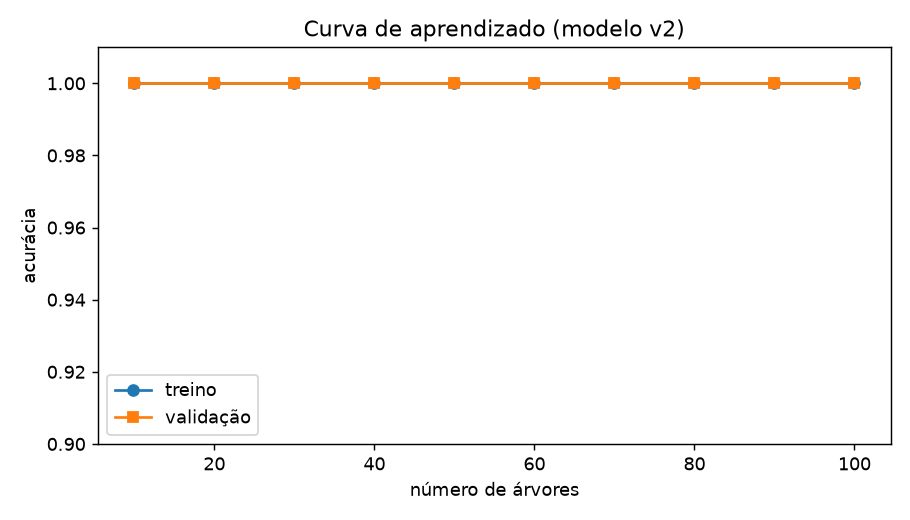
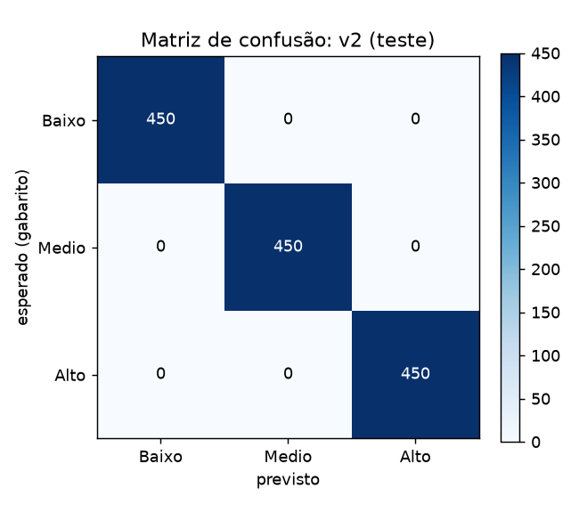
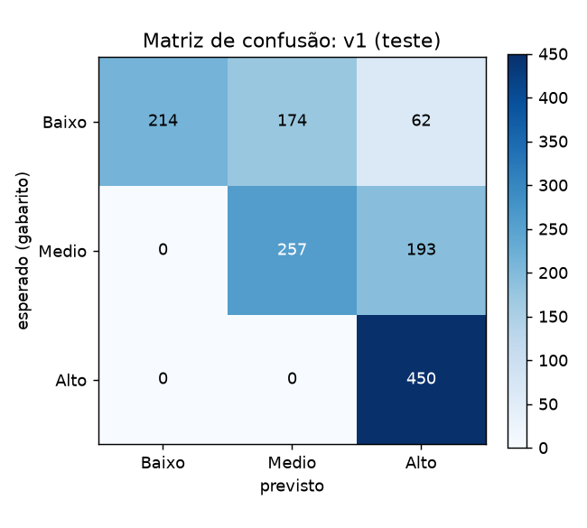
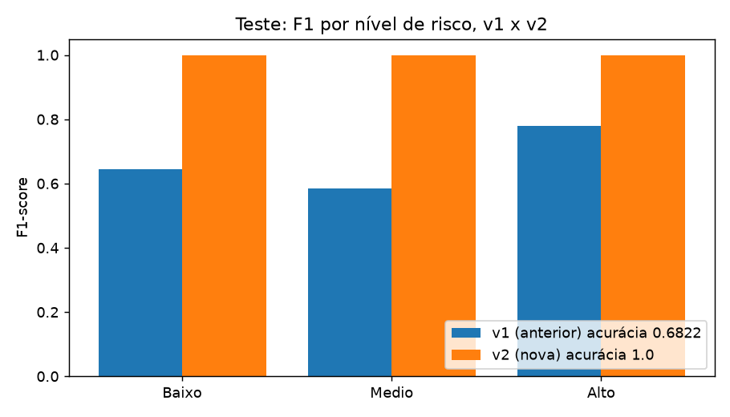

# Relatório: treinamento e teste da IA de risco (v2)

## 1. Resumo executivo

**O modelo v2 não está pronto para uso real.** Ele acerta 100% dos dados de teste sintéticos, mas esse número não prova que ele funciona com pessoas reais. Motivo: os rótulos foram gerados pelas mesmas regras que o modelo aprende. Ele apenas reproduz a regra. Qualquer modelo que aprendesse essa regra teria o mesmo resultado.

O que de fato está validado:

- A montagem das entradas no backend corresponde às regras aprovadas (conferido nos casos de borda).
- A regra de negócio foi aplicada de forma consistente em todos os 9.000 casos gerados.
- A versão v2 corrige os erros da v1 nos casos de borda: **18 de 20 contra 12 de 20** (os 2 casos restantes são sem histórico, tratados pela regra RN07 do backend).
- Não houve nenhum erro perigoso (risco alto classificado como baixo) em nenhum dos conjuntos.

Antes de liberar para uso real, é preciso validar com casos reais rotulados por profissionais (seção 8).

## 2. Dados sintéticos

Gerados por `amparo-ia/pipeline_v2/gerar_dados.py`, com as regras de `regras.py`.

| Conjunto | Casos | Baixo | Médio | Alto |
|---|---:|---:|---:|---:|
| Treino | 6.300 | 2.100 | 2.100 | 2.100 |
| Validação | 1.350 | 450 | 450 | 450 |
| Teste | 1.350 | 450 | 450 | 450 |
| Borda (escritos à mão) | 20 | — | — | — |

- Divisão 70/15/15, estratificada por nível. **Nenhum exemplo se repete entre conjuntos** (verificado: sobreposição 0).
- Os casos sem histórico (nenhuma ocorrência e nenhum acionamento válido) **não entram no gabarito**: a decisão deles é da regra RN07 do backend ("histórico insuficiente → Médio").
- Cobertura: todos os tipos de ocorrência (Física, Sexual, Ameaça, Psicológica, Moral, Patrimonial), casos com e sem botão, acionamentos por engano (até 30 s), recorrência, ocorrências recentes e antigas.
- Os 20 casos de borda estão em `pipeline_v2/dados/borda.csv` e `borda_casos.json`, para revisão.

**Regras usadas como gabarito (aprovadas por você):**

- Física e Sexual = Alto. Ameaça = Médio. Psicológica, Moral e Patrimonial = Baixo.
- Recorrência (2 ou mais ocorrências em 30 dias) sobe um nível, até Alto.
- Acionamento válido (mais de 30 s ou ainda ativo) eleva para pelo menos Médio. Vai a Alto com violência física/sexual ou ocorrência nos últimos 15 dias.
- Acionamento por engano (encerrado em até 30 s) não altera o risco.

**Features do modelo v2 (11):** idade, quantidade de ocorrências, dias desde a última, frequência aumentou, e flags para física, sexual, ameaça, psicológica, moral e patrimonial, mais a quantidade de acionamentos válidos.

## 3. Treinamento

Modelo: `RandomForestClassifier`, escolha por F1 macro na validação.

- **Grade testada:** 12 combinações (100 e 300 árvores; profundidade livre, 6 e 10; folha mínima 1 e 5).
- **Escolhido:** 100 árvores, profundidade livre, folha mínima 1.
- **Resultado:** acurácia de treino 1,00 e de validação 1,00 em **todas** as 12 combinações.
- **Curva de aprendizado:** plana em 100% para treino e validação (`Relatorios/ia_v2/curva_aprendizado.png`).

**Sinal de overfitting:** não é possível medir com estes dados. A ausência de diferença entre treino e validação não significa que o modelo generaliza: significa que os dados são fáceis demais. Um modelo que decorasse a regra teria o mesmo resultado. Por isso a validação não serviu para ajustar nada.

**Versão anterior guardada:** `amparo-ia/modelos_anteriores/v1/`, com os arquivos originais (tamanho e data preservados). Para voltar, basta copiar esses dois arquivos de volta para `amparo-ia/`.

**Ambiente de treino:** Python 3.14.6 e scikit-learn 1.9.0. Se o `venv` da IA usar outra versão do scikit-learn, o carregamento do `.pkl` pode falhar ou emitir aviso. Recomendo fixar a versão no `requirements.txt`.

## 4. Testes

### 4.1 Conjunto de teste (1.350 casos)

| Nível | Precisão | Recall | F1 (v2) | F1 (v1) |
|---|---:|---:|---:|---:|
| Baixo | 1,00 | 1,00 | **1,00** | 0,64 |
| Médio | 1,00 | 1,00 | **1,00** | 0,58 |
| Alto | 1,00 | 1,00 | **1,00** | 0,78 |
| **Acurácia** | | | **1,00** | 0,68 |
| **F1 macro** | | | **1,00** | 0,67 |

Matriz de confusão do v2: 450/450 em cada diagonal, zero fora dela (`matriz_v2.png`).

**Erros perigosos (Alto classificado como Baixo): v2 = 0, v1 = 0.**

A v1 não errou perigosamente, mas errou muito por excesso: classificou 62 casos Baixo como Alto e 193 Médio como Alto. Isso pode gerar alarme desnecessário, mas é um erro de custo menor que o contrário. A matriz da v1 está em `matriz_v1.png`, e a comparação em `comparacao_v1_v2.png`.

### 4.2 Casos de borda (um por um)

| # | Caso | Gabarito | v2 | v1 |
|---|---|---|---|---|
| B01 | Nenhuma ocorrência e nenhum acionamento | RN07 (Médio) | Médio | Baixo |
| B02 | Verbal (Moral) de 200 dias | Baixo | Baixo | Baixo |
| B03 | Verbal (Moral) hoje | Baixo | Baixo | Médio |
| B04 | 5 verbais recorrentes em 30 dias | Médio | Médio | Alto |
| B05 | Física antiga (400 dias) | Alto | Alto | Alto |
| B06 | Ameaça isolada | Médio | Médio | Médio |
| B07 | 3 ameaças em 20 dias | Alto | Alto | Alto |
| B08 | Só um acionamento válido, sem ocorrências | Médio | Médio | Alto |
| B09 | Só um acionamento por engano (10 s) | RN07 (Médio) | Médio | Alto |
| B10 | Verbal hoje + acionamento válido | Alto | Alto | Alto |
| B11 | Física hoje, sem acionamento | Alto | Alto | Alto |
| B12 | 5 acionamentos válidos, sem ocorrências | Médio | Médio | Alto |
| B13 | 3 acionamentos válidos + física | Alto | Alto | Alto |
| B14 | 3 acionamentos por engano + verbal antiga | Baixo | Baixo | Alto |
| B15 | Psicológica recente + engano | Baixo | Baixo | Baixo |
| B16 | Patrimonial + psicológica, hoje | Médio | Médio | Médio |
| B17 | Ameaça + física antiga | Alto | Alto | Alto |
| B18 | Física antiga + acionamento válido | Alto | Alto | Alto |
| B19 | Sexual antiga, sem acionamento | Alto | Alto | Alto |
| B20 | Idade -5 com uma ameaça | **deveria ser recusada** | Médio (aceita) | Médio (aceita) |

**v2: 18 de 20 (B01 e B09 coincidem com a RN07). v1: 12 de 20.**

**Achado importante (B20):** a IA aceita idade negativa e classifica normalmente. Não há validação de faixa de valores no serviço de IA. Isso precisa ser corrigido (seção 7).

Observação sobre B01 e B09: a API não envia esses casos ao modelo. O `main.py` aplica a regra RN07 ("histórico insuficiente" → Médio) antes da predição. O resultado de B01 e B09 do modelo isolado é uma extrapolação, sem valor para a API.

## 5. Análise do botão de emergência

**O acionamento aumenta o risco como deveria?** Sim, nos casos previstos pela regra. Removendo os acionamentos válidos, a classificação mudou em:

- **Regra (gabarito):** 43% dos 309 casos de teste com botão válido.
- **Modelo v2:** 37% dos mesmos casos.
- **Concordância** sobre quais casos mudam: 94%.

**O modelo depende demais ou de menos do botão?** Nem um nem outro, pelos números:

- Não há casos em que o modelo muda e a regra não muda (0 casos).
- O modelo deixa de mudar em 19 casos onde a regra muda. Desses, todos são pacientes **sem histórico** (sem ocorrências), em que o botão é o único dado. A regra desses casos é RN07, e o modelo responde Médio por extrapolação. Não é uma falha do modelo, mas mostra que ele nunca aprendeu esse cenário.

**Acionamento por engano:** o modelo v2 não recebe os acionamentos por engano (o backend só envia os válidos). Se eles fossem contados, 34% das respostas mudariam nos 197 casos de teste com engano. Ou seja, a regra de engano é importante e precisa continuar sendo aplicada no backend.

## 6. Erros mais graves com exemplos

No conjunto de teste, **não houve nenhum erro perigoso** (Alto → Baixo) nem nenhum outro erro no v2.

Os erros mais graves **da versão anterior (v1)** foram de excesso de alarme, não de omissão:

| Entrada resumida | Esperado | v1 previu |
|---|---|---|
| Uma ocorrência verbal hoje | Baixo | Médio (62 casos Baixo viraram Alto) |
| Um acionamento por engano sem histórico | RN07 (Médio) | Alto |
| Três acionamentos por engano + verbal antiga | Baixo | Alto |

Esses casos mostram que a v1 usava a contagem de todos os acionamentos, inclusive os de engano.

## 7. Limitações

1. **Dados sintéticos não substituem dados reais.** As métricas medem a capacidade de reproduzir a regra, não a capacidade de prever risco real. Os 100% de acerto **não devem ser usados como evidência de eficácia**.
2. **O modelo aprende a regra que eu escrevi.** Se a regra estiver errada (por exemplo, se "verbal hoje = Baixo" não for o que um especialista consideraria), o modelo vai errar do mesmo jeito.
3. **Sem casos reais, não há como medir falso negativo de verdade.** O conjunto de teste não tem ruído, ambiguidade nem casos que um profissional discordaria.
4. **Sem casos sem histórico no treino.** A API resolve esses casos pela RN07, antes do modelo (corrigido).
5. **Validação de faixa de valores** (corrigido). Idade fora de 0 a 120, flags diferentes de 0 e 1, e dias fora de 0 a 999 agora retornam 422. O caso B20 foi recusado.
6. **Versão do scikit-learn**: fixada no `requirements.txt` (1.9.0, com as demais dependências testadas).

## 8. Status dos problemas

- Validação de faixa de valores na IA: **corrigido** (retorna 422).
- Caso sem histórico: **já tratado pela API** (RN07, antes do modelo).
- Versão do scikit-learn: **fixada** no `requirements.txt`.
- Dados reais rotulados por especialistas: **pendente**. Depende de você (seção abaixo).

## 9. Recomendações (em ordem de prioridade)

1. **Validar as regras com um especialista** (psicóloga, assistente social ou pesquisadora de violência contra a mulher). Os 20 casos de borda são um bom roteiro para essa conversa.
2. **Validar entradas no serviço de IA**: faixas de idade, contagens não negativas e datas plausíveis. Hoje o B20 é aceito.
3. **Obter casos reais anonimizados e rotulados** por profissionais, para testar o modelo fora do ambiente sintético.
4. **Tratar explicitamente o caso sem histórico** no modelo ou documentar que ele fica fora da IA (hoje depende da RN07 do backend).
5. **Fixar a versão do scikit-learn** no `requirements.txt` e documentar a versão usada para treinar.
6. **Manter o pipeline reproduzível**: `gerar_dados.py` → `treinar.py` → `testar.py` → `graficos.py`, em `amparo-ia/pipeline_v2/`.

## Arquivos

- Código: `amparo-ia/pipeline_v2/` (`regras.py`, `gerar_dados.py`, `treinar.py`, `testar.py`, `graficos.py`)
- Dados: `amparo-ia/pipeline_v2/dados/`
- Resultados: `amparo-ia/pipeline_v2/resultados/` (`treino.json`, `teste.json`, `borda_resultados.csv`)
- Versão anterior: `amparo-ia/modelos_anteriores/v1/`
- Gráficos: `Relatorios/ia_v2/`

